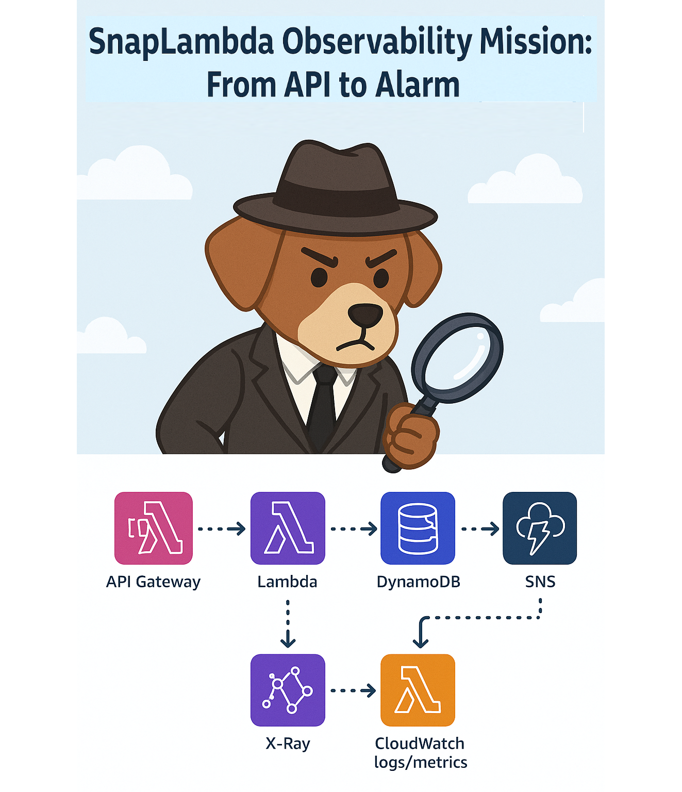
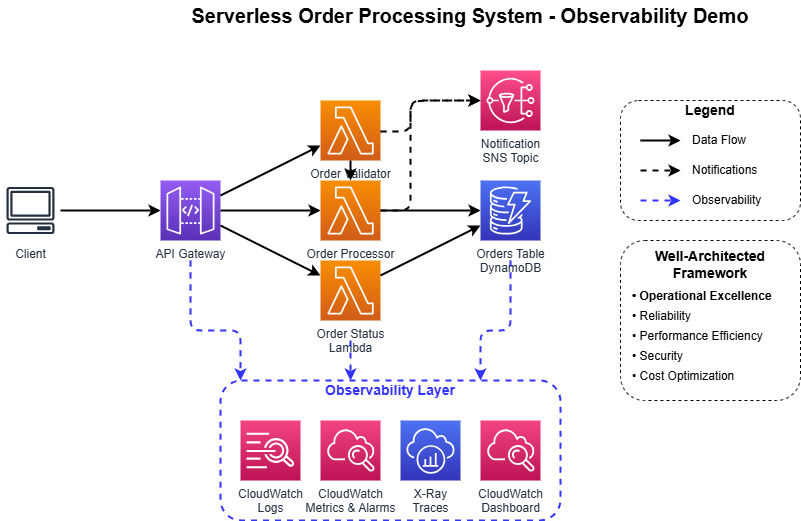

# Serverless Order Processing System - Observability Demo

This demo showcases a comprehensive approach to observability in a serverless architecture using AWS services.



## Architecture Overview

The demo implements a simple serverless order processing system with these components:

| Component                | Role                                                  |
| ------------------------ | ----------------------------------------------------- |
| API Gateway              | Exposes REST endpoints for order submission and status checking  |
| Lambda: `OrderValidator` | Validates incoming orders                             |
| Lambda: `OrderProcessor` | Processes valid orders and saves to DynamoDB          |
| Lambda: `OrderStatus`    | Retrieves order status                                |
| DynamoDB                 | Stores order and status information                   |
| SNS Topic                | Publishes failure alerts                              |
| CloudWatch               | Stores logs, metrics, dashboards                      |
| AWS X-Ray                | Traces API-to-Lambda-to-DynamoDB interactions         |
| CloudTrail               | Logs API activity and changes                         |

👉 Check [architecture details](./architecture-components.md)



---

## Observability Features Demonstrated

1. **Metrics**:
   - Built-in Lambda, API Gateway, and DynamoDB metrics
   - Custom business metrics (order validation rate, processing time)

2. **Logs**:
   - Structured logging across all Lambda functions
   - Log correlation with X-Ray trace IDs

3. **Metric Filters**:
   - Extracting error rates from logs
   - Creating custom metrics from log patterns

4. **Alarms**:
   - Error rate thresholds
   - Latency thresholds
   - Composite alarms

5. **Traces with X-Ray**:
   - End-to-end request tracing
   - Service maps
   - Latency analysis

---

## Deployment Instructions

### Prerequisites

- AWS CLI installed and configured
- AWS SAM CLI installed
- Python 3.11+

### Deploy the Application

1. Clone this repository
2. Navigate to the project directory
3. Deploy using SAM CLI:

* **Build your project**

```bash
sam build
```

* **Deploy (with default parameters) using SAM**

```bash
sam deploy
```

* **SAM deploy options**
   * Use another AWS profile: `--profile <YOUR_AWS_PROFILE>`
   * Set deployment region: `--region <YOUR_AWS_REGION>`
   * Override template parameters: `--parameter-overrides Environment=<YOUR_ENVIRONMENT> NotificationEmail=<YOUR_EMAIL_ADDRESS>`

* **Full build and deploy command example**

```bash
# To build your app
sam build

# To deploy with different parameters
sam deploy --region <YOUR_AWS_REGION> --profile <YOUR_AWS_PROFILE> --parameter-overrides Environment=<YOUR_ENVIRONMENT> NotificationEmail=<YOUR_EMAIL_ADDRESS>
```

👉 **Follow the prompts to complete the deployment.**

---

## Testing and troubleshooting the Application

### Submit an Order

```bash
curl -X POST \
  https://{api-id}.execute-api.{region}.amazonaws.com/{stage}/order \
  -H 'Content-Type: application/json' \
  -d '{
    "customerName": "John Doe",
    "productId": "PROD-123",
    "quantity": 2
  }'
```

### Check Order Status

```bash
curl -X GET \
  https://{api-id}.execute-api.{region}.amazonaws.com/{stage}/order/{orderId}
```

### Troubleshooting scenarios

👉 Check [step-by-step troubleshooting with observability tools guide](./troubleshooting-guide.md)

---

## Clean Up

To avoid incurring charges, delete the resources when you're done:

```bash
sam delete --region <YOUR_AWS_REGION> --profile <YOUR_AWS_PROFILE>
```

---

## Well-Architected Framework Connection

This demo illustrates key aspects of the AWS Well-Architected Framework:

- **Operational Excellence**: Comprehensive monitoring and observability
- **Reliability**: Error detection and notification
- **Performance Efficiency**: Latency tracking and bottleneck identification
- **Security**: Proper IAM permissions and secure API endpoints
- **Cost Optimization**: Serverless architecture with pay-per-use pricing

These practices help us build resilient, high-performing applications that meet business requirements."

---

## What's next?

### Ideas of improvements

- Store non validated orders into another DynamoDB table
- Write validated orders into an SQS queue and have Order Processing Lambda function read from it

### Additional knowledge
After this demo, you may seek further knowledge about:
- Implementation details
- Best practices for observability
- Cost considerations
- Scaling observability for larger applications

### Additional Resources
- [AWS X-Ray Documentation](https://docs.aws.amazon.com/xray/latest/devguide/aws-xray.html)
- [CloudWatch Logs Documentation](https://docs.aws.amazon.com/AmazonCloudWatch/latest/logs/WhatIsCloudWatchLogs.html)
- [CloudWatch Metrics Documentation](https://docs.aws.amazon.com/AmazonCloudWatch/latest/monitoring/working_with_metrics.html)
- [AWS Lambda Permissions](https://docs.aws.amazon.com/lambda/latest/dg/lambda-permissions.html)