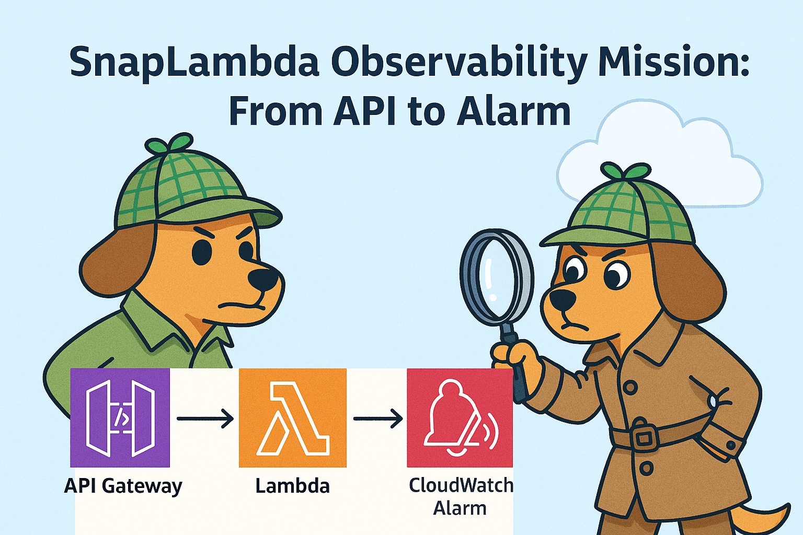

# AWS Observability Demo - Troubleshooting Guide

This guide will walk you through a series of common issues in serverless applications and how to diagnose them using AWS observability tools. You'll learn how to use CloudWatch Logs, X-Ray traces, and CloudWatch metrics to identify and fix problems in a real-world scenario.



## Prerequisites

- AWS CLI configured with appropriate permissions
- The demo application deployed to your AWS account
- Access to AWS Console (CloudWatch, X-Ray, Lambda, API Gateway, DynamoDB)

## Demo Preparation

1. Deploy the application using SAM CLI:
   ```bash
   sam build
   sam deploy --guided --region <YOUR_AWS_REGION> --profile <YOUR_AWS_PROFILE> --parameter-overrides Environment=<YOUR_ENVIRONMENT> NotificationEmail=<YOUR_EMAIL_ADDRESS>
   ```

2. Note the API Gateway endpoint URL from the outputs.

3. Open multiple browser tabs for:
   - CloudWatch Dashboard
   - X-Ray Traces
   - CloudWatch Logs
   - CloudWatch Alarms
   - Api Gateway
   - Notification Email Inbox

4. Validate the email subscription sent created by `sam deploy` to receive notifications
   - Go to the inbox of the email provided to the template. Default value is `serverless-observability-demo@mailinator.com`
   - Validate the subscription

5. Optional: Add another email subscription to the demo SNS topic to receive notifications
   - Go to SNS, 
   - Choose the lab topic
   - Choose tab `Subscriptions`
   - Click on `Create subscription`
   - On Details / Protocol, choose: `Email`
   - In `Endpoint` input field, add your email
   - Click on `Create subscription`
   - Go to your email inbox
   - Validate the subscription

## Scenario Overview

You've deployed a serverless order processing system with three Lambda functions:
- **OrderValidatorFunction**: Validates incoming orders from API Gateway
- **OrderProcessorFunction**: Processes valid orders and stores them in DynamoDB
- **OrderStatusFunction**: Retrieves order status from DynamoDB

However, users are reporting issues with the system. Let's see how we can use these tools to troubleshoot those issues one by one.

## Issue 1: Order validation failed notifications

### Symptoms
- Users report that some order creation attempts fail
- API Gateway returns `Order validation failed message` with http code 400

### Confirm the issue

Try to generate some error traffic:
```bash
# Send several invalid orders
curl -X POST \
   "https://{api-id}.execute-api.{region}.amazonaws.com/{stage}/order" \
   -H "Content-Type: application/json" \
   -d '{"customerName": "Test Customer", "quantity": 2}'

curl -X POST \
   "https://{api-id}.execute-api.{region}.amazonaws.com/{stage}/order" \
   -H "Content-Type: application/json" \
   -d '{"customerName": "Test Customer", "quantity": -2, "productId": "Demo Product"}'
```

### Investigation Steps

1. **Check Email Notifications**:
   - Check for `Order Validation Failed - <Environment>` notification
   - Note the orderId

2. **Check CloudWatch Logs for the OrderValidatorFunction**:

Navigate to CloudWatch Logs in the AWS Console and examine the logs for the OrderValidatorFunction: `/aws/lambda/SnapLambda-OrderValidator-<Environment>`.

Look for the `<YOUR_ORDER_ID>` you've noted earlier

### Root Cause
The order validation failed for one of these 3 resaons:
- Missing required field
- Invalid quantity
- Simulated random validation error

### Solution
1. Missing required field: add the missing field and retry
2. Invalid quantity: fix the quantity and retry
3. Simulated random validation error: 
   - Open the functions/validator/app.py file
   - Find the `TODO 1: remove this random test to fix troubleshooting case`:
```python
   # TODO 1: remove or comment out this random test to fix troubleshooting case
   #if random.random() < 0.1:
   #    logger.error("Validation failed: Simulated random validation error")
   #    return False
```
   - Redeploy the application:
```bash
sam build 
sam deploy
   ```
### Verification
Try creating a new order with the issue fixed:

```bash
# Send a valid order
curl -X POST \
   "https://{api-id}.execute-api.{region}.amazonaws.com/{stage}/order" \
   -H "Content-Type: application/json" \
   -d '{"customerName": "Test Customer", "quantity": 2, "productId": "Demo Product"}'
```

   - Note that no *`Order Validation Failed - <Environment>`* notification is sent.
   - API Gateway no longer returns *`Order validation failed message`* with http code 400

## Issue 2: All Order Creation Requests Are Rejected

### Symptoms
- Users report that all order creation attempts fail
- No orders appear in the DynamoDB table
- API Gateway returns `Internal server error during order validation` with http code 500

### Confirm the issue

Create some orders
- **For Linux/Mac**
```bash
./test-orders.sh <api-endpoint> 20 1
```
- **For Windows**
```PowerShell
.\test-orders.ps1 -ApiEndpoint <api-endpoint> -NumOrders 20 -DelaySeconds 1
```

### Investigation Steps

1. **Check CloudWatch Logs for the OrderValidatorFunction**:
   Navigate to CloudWatch Logs in the AWS Console and examine the logs for the OrderValidatorFunction: `/aws/lambda/SnapLambda-OrderValidator-<Environment>`.

2. **Examine X-Ray Traces**:
   - Go to the AWS X-Ray console
   - Look at the service map to see the flow of requests
   - Notice that there's no connection between OrderValidatorFunction and OrderProcessorFunction
   - Select a trace for an order creation request and examine the details
   - Notice that there's an error when OrderValidatorFunction tries to invoke OrderProcessorFunction
   - Select a trace and look for the **AccessDeniedException** error

3. **Check CloudWatch Metrics**:
   - Go to CloudWatch Metrics
   - Look at the Lambda invocation metrics for both functions
   - **Notice that OrderProcessorFunction is never invoked**

4. **Check Email Notifications**:
   - Check your email for any alarm notifications
   - You might see an alarm for OrderValidatorFunction errors

5. **Check the Lambda Function Configuration**:
   - Go to the Lambda console
   - Check the permissions for OrderValidatorFunction
   - Notice it's missing the Lambda InvokeFunction permission for OrderProcessorFunction

### Root Cause
The OrderValidatorFunction doesn't have permission to invoke the OrderProcessorFunction. This is because the LambdaInvokePolicy is commented out in the template.yaml file.

### Solution
1. Open the template.yaml file
2. Find the TODO 2 comment and uncomment the LambdaInvokePolicy:
```yaml
# TODO 2: Uncomment to enable lambdaInvoke on OrderProcessorFunction
- LambdaInvokePolicy:
      FunctionName: !Ref OrderProcessorFunction
```
3. Redeploy the application:
```bash
sam build 
sam deploy
```

### Verification
Try creating a new order with the issue fixed:

```bash
# Send a valid order
curl -X POST \
   "https://{api-id}.execute-api.{region}.amazonaws.com/{stage}/order" \
   -H "Content-Type: application/json" \
   -d '{"customerName": "Order Processing Function Test", "quantity": 2, "productId": "Demo Product"}'
```

   - API Gateway returns *`Order validated and submitted for processing with order_id`* with http code 200

## Issue 3: Orders Still Fail After Fixing Permissions

### Symptoms
- Order creation still fails even after fixing the invoke permissions
- OrderProcessorFunction is now being invoked, but orders aren't stored in DynamoDB
- API Gateway returns successful responses, but the database remains empty

### Confirm the issue

Try creating a new valid order:

```bash
curl -X POST \
   "https://{api-id}.execute-api.{region}.amazonaws.com/{stage}/order" \
   -H "Content-Type: application/json" \
   -d '{"customerName": "Order Processing Function Test", "quantity": 2, "productId": "Demo Product"}'
```

### Investigation Steps

1. **Check CloudWatch Logs for the OrderProcessorFunction**:

Navigate to CloudWatch Logs in the AWS Console and examine the logs for the OrderProcessorFunction: `/aws/lambda/SnapLambda-OrderProcessor-<Environment>`.

Look for error messages related to DynamoDB access.

2. **Examine X-Ray Traces**:
   - Go to the X-Ray console
   - Look at the service map - you should now see connections between OrderValidatorFunction and OrderProcessorFunction
   - Notice that there's an error when OrderProcessorFunction tries to access DynamoDB
   - Select a trace and look for the **AccessDeniedException** error

3. **Check CloudWatch Metrics**:
   - Look at the Lambda error metrics for OrderProcessorFunction
   - You should see errors occurring when it tries to write to DynamoDB

4. **Check the Lambda Function Configuration**:
   - Go to the Lambda console
   - Check the permissions for OrderProcessorFunction
   - Notice it **has** the DynamoDB **deny PutItem** permission

### Root Cause
The OrderProcessorFunction has an explicit Deny policy for the DynamoDB PutItem action, which is overriding the Allow policy.

### Solution
1. Open the template.yaml file
2. Find the TODO 3 comment and comment out or remove the Deny policy:
```yaml
# TODO 3: Comment the following policy to remove the deny dynamodb:PutItem
# - Version: '2012-10-17'
#   Statement:
#     - Sid: DenyDynamoDBPutItem
#       Effect: Deny
#       Action: dynamodb:PutItem
#       Resource: !GetAtt OrdersTable.Arn
```
3. Redeploy the application:
```bash
sam build 
sam deploy
```

### Verification
Try creating a new valid order:

```bash
# Send a valid order
curl -X POST \
   "https://{api-id}.execute-api.{region}.amazonaws.com/{stage}/order" \
   -H "Content-Type: application/json" \
   -d '{"customerName": "Order Processing Function Test", "quantity": 2, "productId": "Demo Product"}'
```

   - API Gateway returns http status code 200 with message
```json
{
   "message": "Order validated and submitted for processing",
   "orderId": "<SOME_ORDER_ID>"
}
```
   - An order with the corresponding order_id is recorded in DynamoDB
   - Check your email inbox for a `Order Processed Successfully - <Environment>` notification


## Issue 4: Order Status Metrics Are Not Updated

### Symptoms
- Users can create orders successfully now
- They can also retrieve order status
- However, no order get status related metrics are stored

### Confirm the issue

```bash
curl -X GET \
  https://{api-id}.execute-api.{region}.amazonaws.com/{stage}/order/{orderId}
```

### Investigation Steps

1. **Check CloudWatch Logs for the OrderStatusFunction**:

Navigate to CloudWatch Logs in the AWS Console and examine the logs for the OrderStatusFunction: `/aws/lambda/SnapLambda-OrderStatus-<Environment>`.

Look for error messages related to CloudWatch metrics.

2. **Examine X-Ray Traces**:
   - Go to the X-Ray console
   - Look at traces for GET requests to /order/{orderId}
   - Notice that OrderStatusFunction successfully retrieves data from DynamoDB
   - But then fails when trying to publish metrics to CloudWatch

3. **Check the Lambda Function Configuration**:
   - Go to the Lambda console
   - Check the permissions for OrderStatusFunction
   - Notice it's missing the CloudWatch PutMetric permission

### Root Cause
The OrderStatusFunction is trying to publish custom metrics to CloudWatch but doesn't have the necessary permissions because the CloudWatchPutMetricPolicy is commented out in the template.yaml file.

### Solution
1. Open the template.yaml file
2. Find the TODO 3 comment and uncomment the CloudWatchPutMetricPolicy:
   ```yaml
   # TODO 4: Uncomment to enable OrderStatusFunction to put custom metrics to CloudWatch
   - CloudWatchPutMetricPolicy: {}
   ```
3. Redeploy the application:
```bash
sam build 
sam deploy
```

### Verification
Try retrieving the status of an order:

```bash
curl -X GET \
  https://{api-id}.execute-api.{region}.amazonaws.com/{stage}/order/{orderId}
```

- There are no CloudWatch put metric error message anymore

## Conclusion

Congratulations! You've successfully diagnosed and fixed three common issues in serverless applications:

1. **Invalid Orders Management**: Lambda rejects orders with invalid parameters
2. **Missing Invoke Permissions**: Lambda functions need explicit permissions to invoke other Lambda functions
3. **Conflicting IAM Policies**: Explicit Deny policies override Allow policies
4. **Missing CloudWatch Permissions**: Lambda functions need permissions to publish custom metrics

These troubleshooting skills are essential for maintaining reliable serverless applications in production. By using AWS observability tools like CloudWatch Logs, X-Ray traces, and CloudWatch metrics, you can quickly identify and resolve issues before they impact your users.
